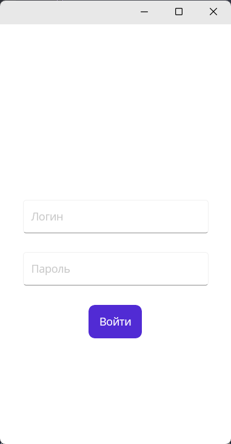
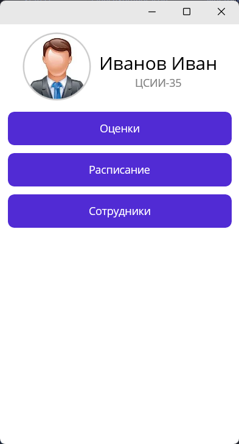
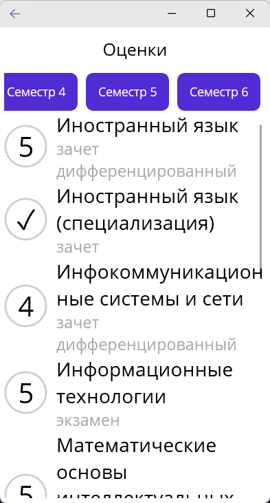
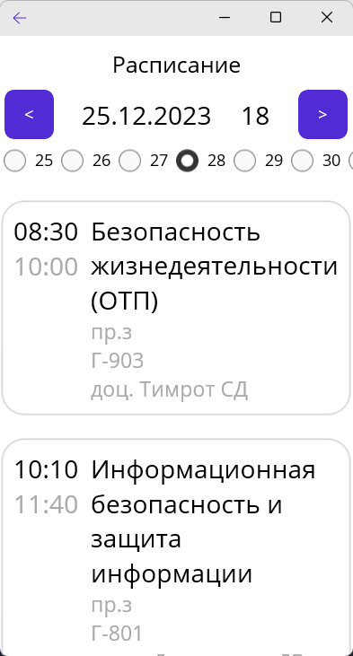

## Мой ЯГТУ
Приложение для мобильного доступа к личному кабинету ЯГТУ.

## Функции
* Просмотр сведений о пользователе личного кабинета;
* Просмотр успеваемости студента (список оценок по семестрам);
* Просмотр расписания занятий;
* Просмотр списка сотрудников ВУЗа;

## Используемые технологии и билиотеки
* [.NET MAUI](https://github.com/dotnet/maui) - кросс-платформенная платформа для создания собственных мобильных и классических приложений с помощью C# и XAML;
* [HtmlAgilityPack](https://github.com/zzzprojects/html-agility-pack) - парсинг веб-страниц;
* [NLog](https://github.com/NLog/NLog.Targets.MauiLog) - логирование ошибок;
* [The49.Maui.BottomSheet](https://github.com/the49ltd/The49.Maui.BottomSheet) - реализация нижней шторки;

## Скриншоты

